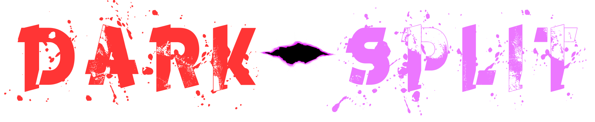

 

<h1 align="center">Dark - Split 🕹️</h1>

### 
 Dark-Split is an exciting 3-D puzzle platformer with a twist. It requires players to use their wit and speed to overcome the challenging terrrain and mobs. 

 By: Dharsan R., Cyrus B., & Caleb H.

### <h1 align="center"> Demo 📀</h1>
https://user-images.githubusercontent.com/67665008/189557969-976c4ee4-6c40-4afb-80f1-0f1f5fde21b6.mp4

### <h1 align="center">Synopsis 📜</h1>

Dark-Split follows the story of Sirius, a man who has been cursed to roam the world as a were-wolf. With this curse however comes a newfound ability for Sirius to jump through the dark dimension. Sirius can switch dimensions at will, so he is on a mission to use his new abilities to gain the three sacred keys which can cure his curse. It is up to you to help Sirius to traverse through the dangerous dark dimension. You must solve puzzles and avoid enemies by switching bewteen the light and dark dimensions. Be carful as haphazardly jumping through dimensions can lead to your failure.

### <h1 align="center">Control Scheme 🎮</h1>

This game is supported by any modern browser as it runs in WebGL. Mobile devices are currently not supported.

* Space Bar: Used to jump. Press twice to double jump.
* Left Mouse Button: Used to switch dimension. Press once to switch to alternate dimension. 
* Mouse Cursor: Move to adjust camera angle.
* W Key: Used to move forward.
* A Key: Used to move left.
* S Key: Used to move backward.
* D Key: Used to move right.

### <h1 align="center">Future Steps 🚧</h1>
* Fix minor clipping issues in 3 platforms.
* Implement a mobile version.

* Play Testing: https://docs.google.com/document/d/1N3jz9Xc7yGnbb8vq1fP6iX0JtnGoio6O2Igvc3sB9rQ/edit?usp=sharing
* Asset Pack: https://assetstore.unity.com/packages/3d/environments/urban/urban-city-pack-34832
